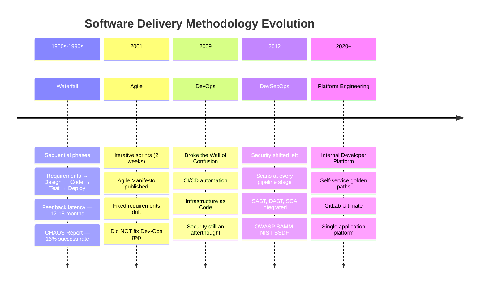
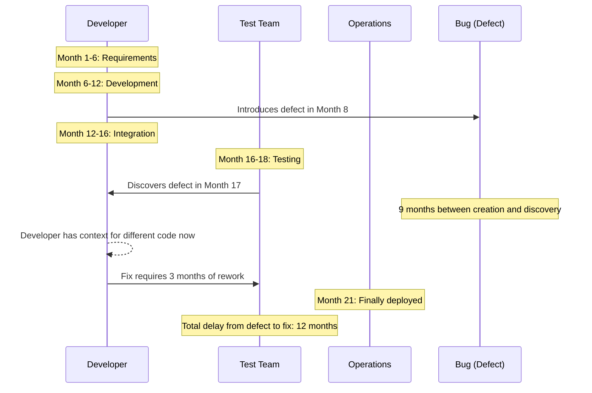
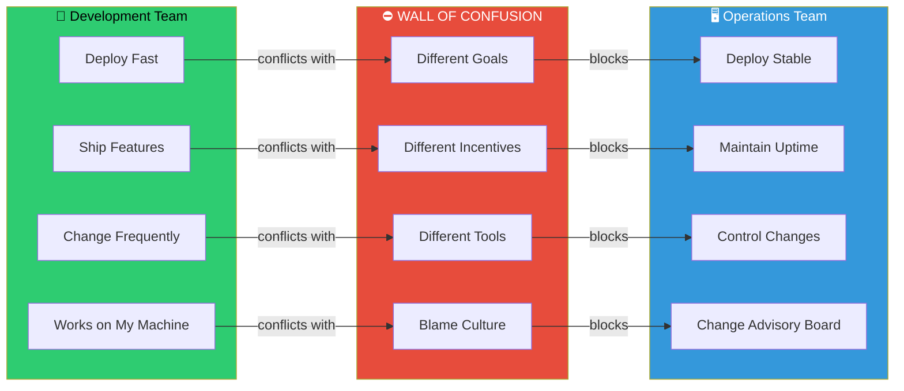
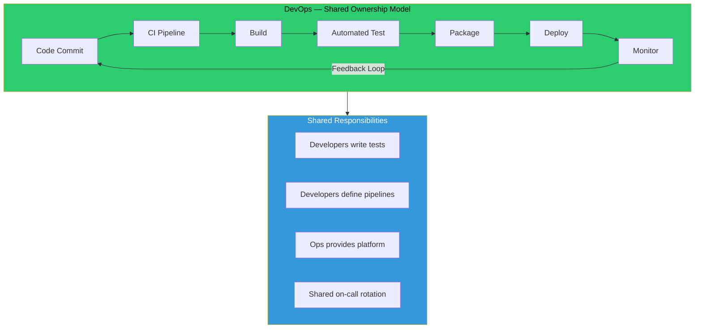
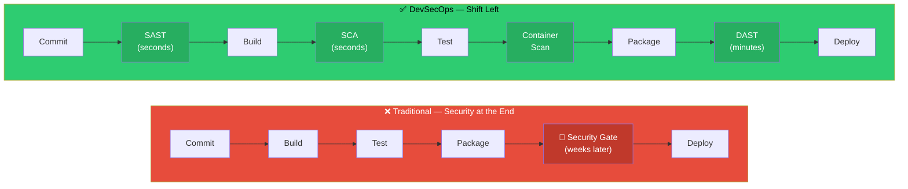
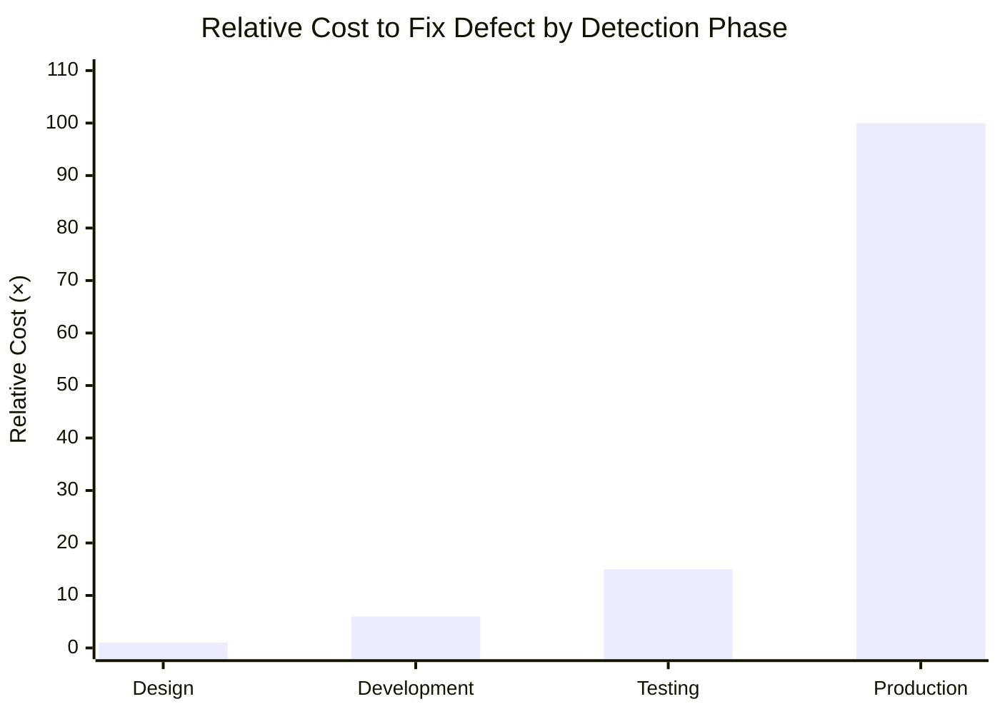
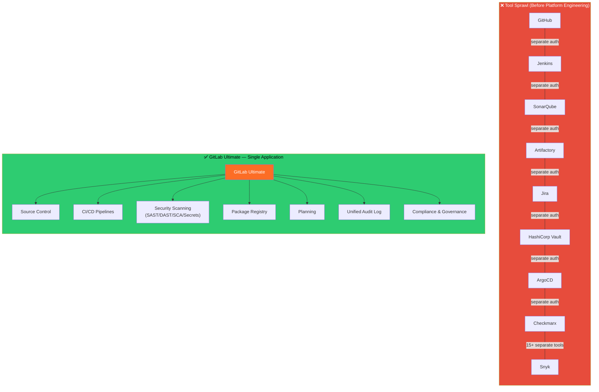
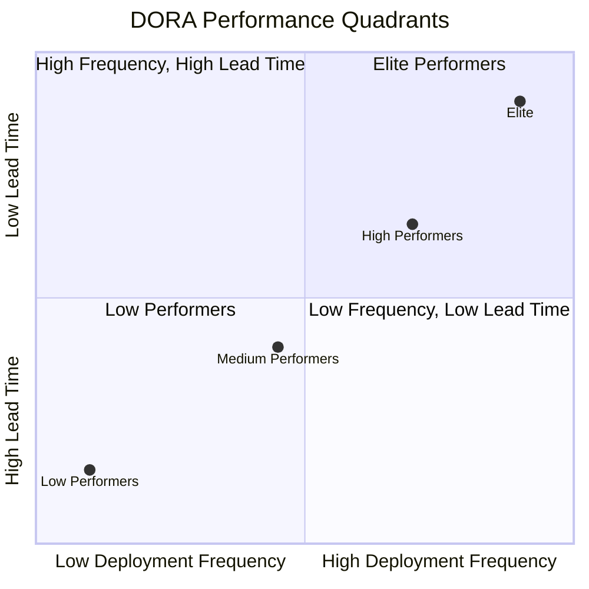
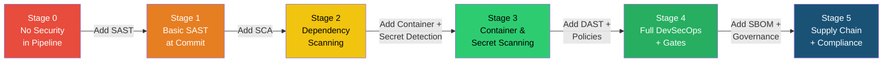
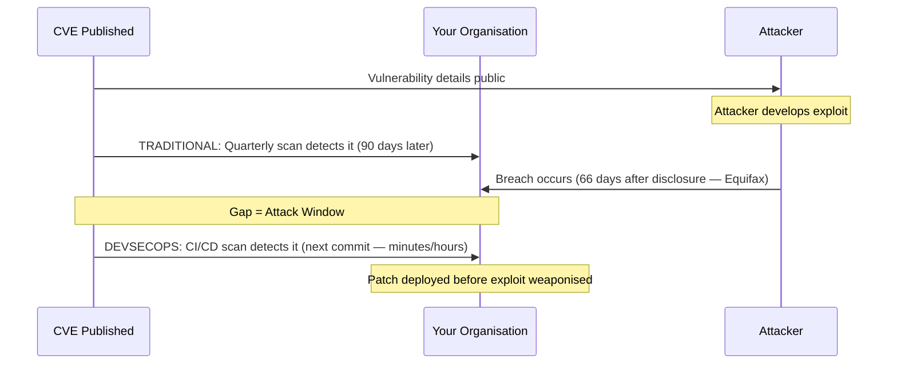

# ARCHITECTURE DIAGRAMS — MODULE 1
## Evolution of Software Delivery
### All diagrams in Mermaid format — render at https://mermaid.live

---

## Diagram 1: Software Delivery Evolution Timeline

---

## Diagram 2: Waterfall Feedback Latency Problem

---

## Diagram 3: The Wall of Confusion

---

## Diagram 4: DevOps — Breaking the Wall

---

## Diagram 5: Security at the End vs Shift Left

---

## Diagram 6: Cost of Defect Detection — Business Case

---

## Diagram 7: Platform Engineering — Tool Sprawl vs Consolidation

---

## Diagram 8: DORA Metrics Visualisation

---

## Diagram 9: DevSecOps Maturity Stages

---

## Diagram 10: Vulnerability Attack Window Concept

---

## Usage Notes for Instructors

- All diagrams render at https://mermaid.live — paste the code block content
- For whiteboard sessions, use Diagrams 3 (Wall of Confusion) and 5 (Shift Left) as hand-drawn starting points
- Diagram 6 (Cost of Defect) should be shown early and referenced throughout Day 2
- Diagram 9 (Maturity Stages) is used again in Module 16 (DORA Metrics)
