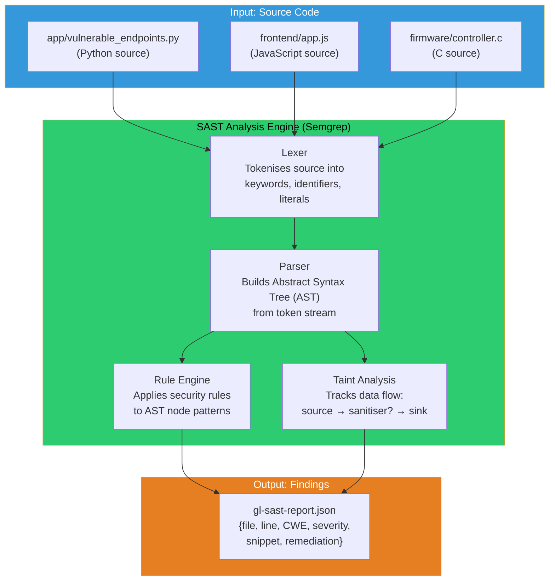
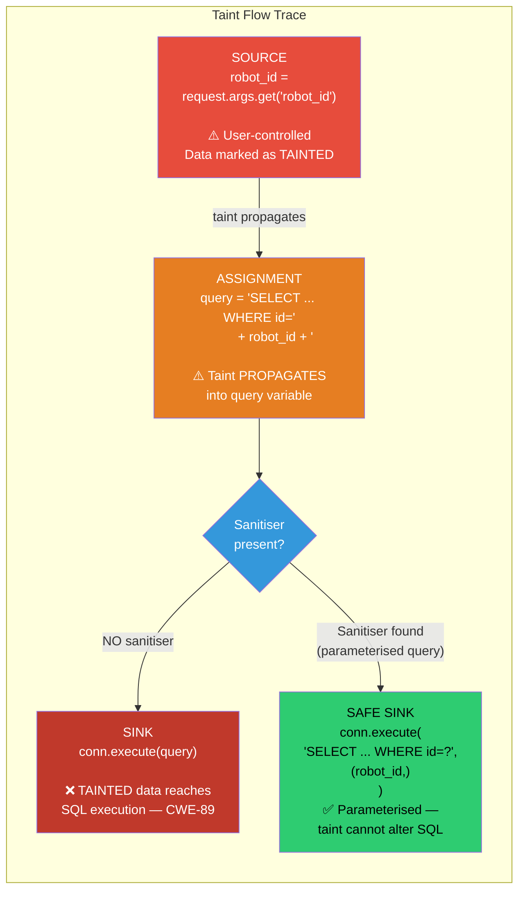
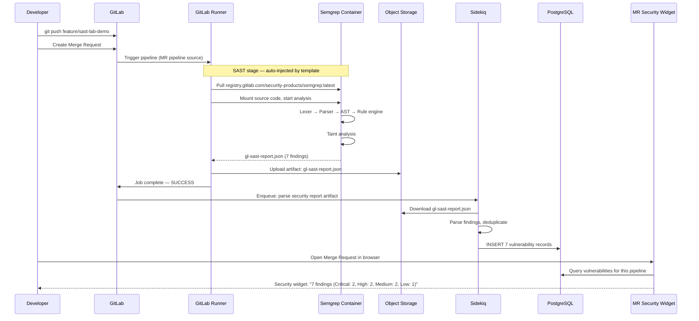
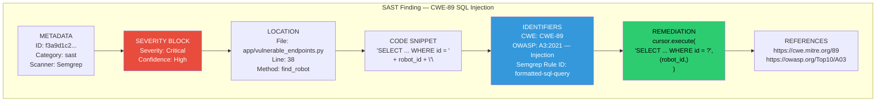
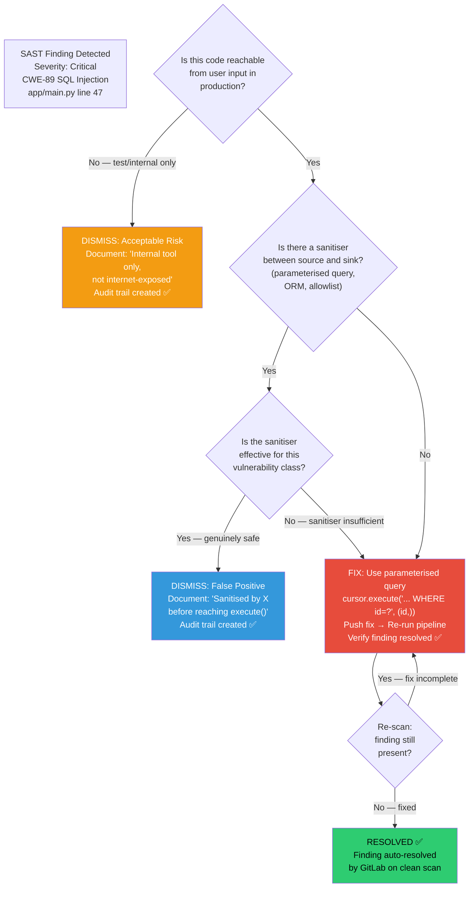
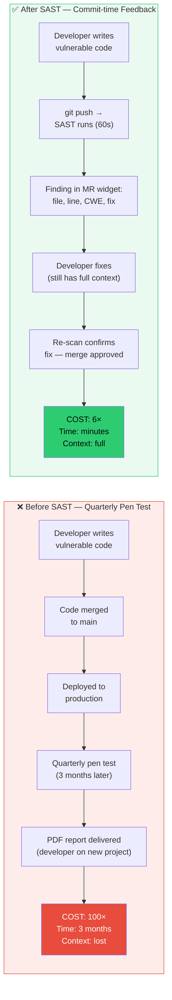
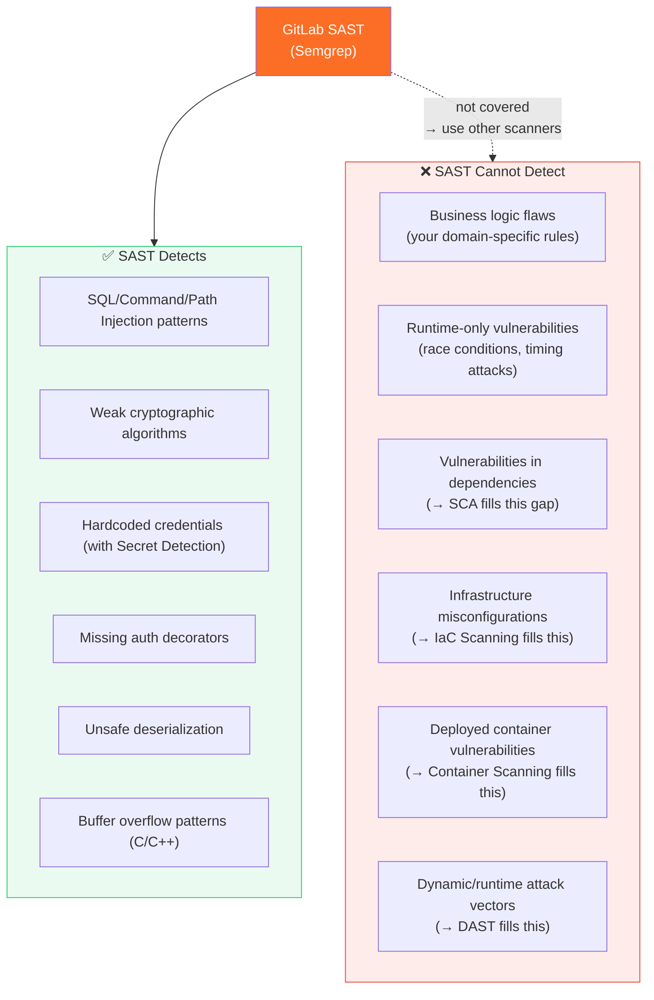

# ARCHITECTURE DIAGRAMS — MODULE 10
## Static Application Security Testing (SAST)
### Render at https://mermaid.live

---

## Diagram 1: SAST Internal Analysis Pipeline

---

## Diagram 2: Taint Analysis — SQL Injection Detection

---

## Diagram 3: GitLab SAST — From include: to MR Widget

---

## Diagram 4: SAST Finding Anatomy

---

## Diagram 5: SAST Finding Triage Decision Flow

---

## Diagram 6: Before and After SAST — Developer Feedback Loop

---

## Diagram 7: SAST Coverage Gap — What Complements It

