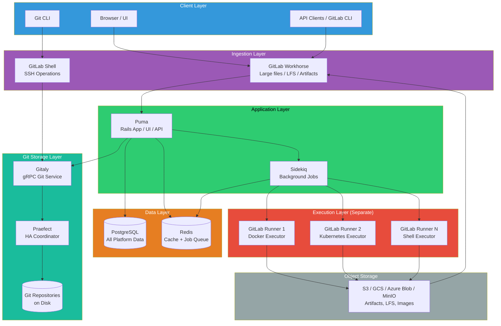
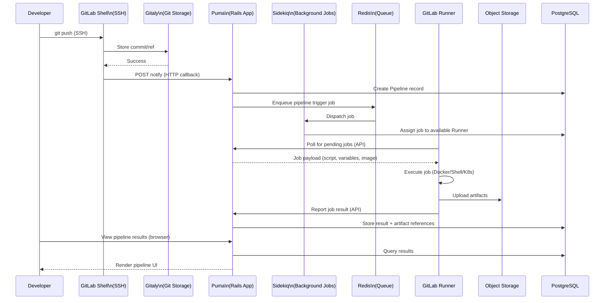
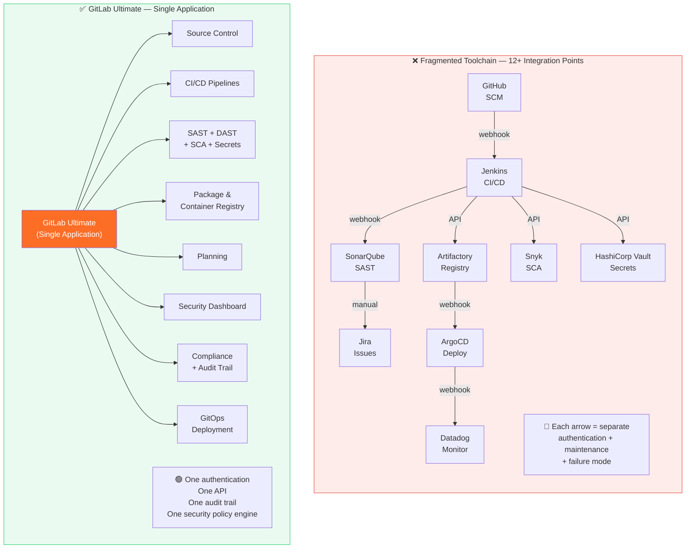
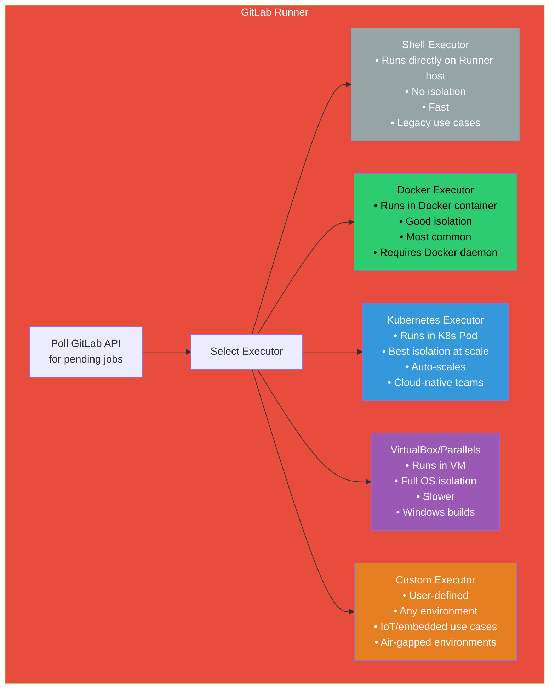
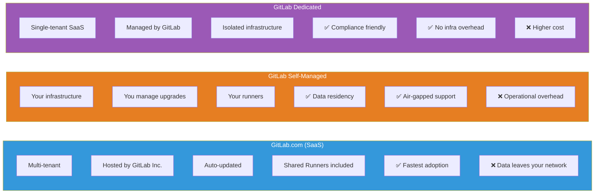

# ARCHITECTURE DIAGRAMS — MODULE 2
## GitLab Ultimate Overview
### Render at https://mermaid.live

---

## Diagram 1: GitLab Component Architecture

---

## Diagram 2: Request Flow — Developer Push to Pipeline Result

---

## Diagram 3: Single Application vs Fragmented Toolchain

---

## Diagram 4: GitLab Tier Capability Map

```mermaid
graph LR
    subgraph FREE ["GitLab Free"]
        F1["✅ Git SCM"]
        F2["✅ Basic CI/CD"]
        F3["✅ Container Registry"]
        F4["✅ Basic SAST\n(Semgrep)"]
        F5["✅ Basic Secret Detection"]
        F6["✅ 5 users max / shared Runners"]
    end

    subgraph PREMIUM ["GitLab Premium\n(adds to Free)"]
        P1["✅ Multi-level MR Approvals"]
        P2["✅ SAML / SSO"]
        P3["✅ Audit Events"]
        P4["✅ Code Owners"]
        P5["✅ Protected Environments"]
        P6["✅ Merge Request Analytics"]
    end

    subgraph ULTIMATE ["GitLab Ultimate\n(adds to Premium)"]
        U1["✅ Dependency Scanning (SCA)"]
        U2["✅ DAST"]
        U3["✅ Container Scanning"]
        U4["✅ IaC Security Scanning"]
        U5["✅ License Compliance"]
        U6["✅ Security Dashboard"]
        U7["✅ Vulnerability Management"]
        U8["✅ Security Policies"]
        U9["✅ SBOM / Dependency List"]
        U10["✅ Compliance Frameworks"]
        U11["✅ Advanced SAST"]
    end

    FREE --> PREMIUM --> ULTIMATE

    style FREE fill:#95a5a6,color:#fff
    style PREMIUM fill:#3498db,color:#fff
    style ULTIMATE fill:#fc6d26,color:#fff
```

---

## Diagram 5: GitLab Runner Executor Types

---

## Diagram 6: GitLab Deployment Models

---

## Usage Notes

- Diagram 1 and 2 are primary teaching diagrams for Module 2
- Diagram 3 (Fragmented vs Unified) is the most effective whiteboard diagram for generating discussion
- Diagram 4 (Tier Map) used when explaining why Ultimate is required for security features
- Diagram 5 (Runner Executors) referenced again in Module 5 (CI/CD Fundamentals) and Module 15 (IoT/Robotics)
- Diagram 6 (Deployment Models) used when organisations ask about air-gapped/regulated deployments
