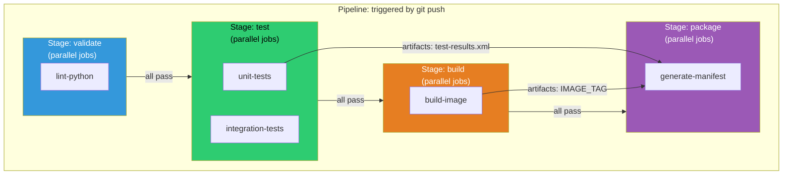
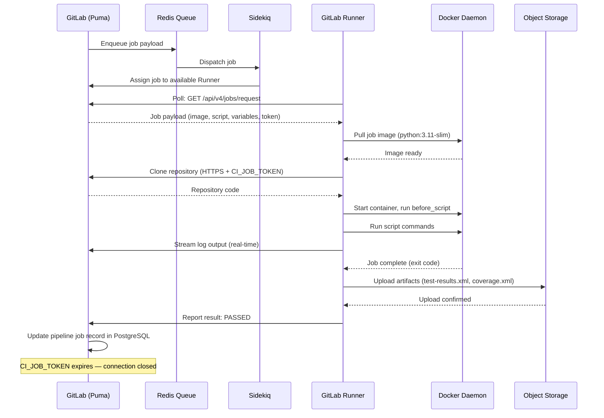
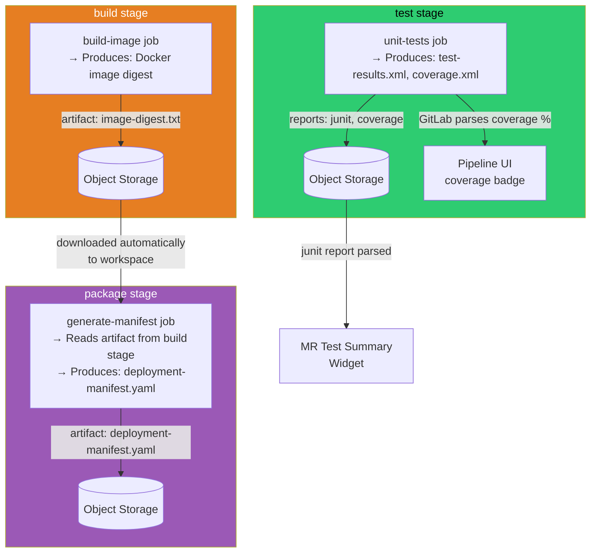
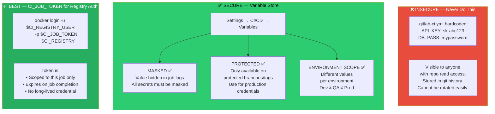
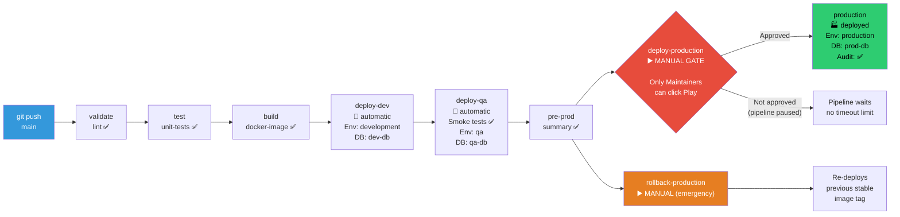
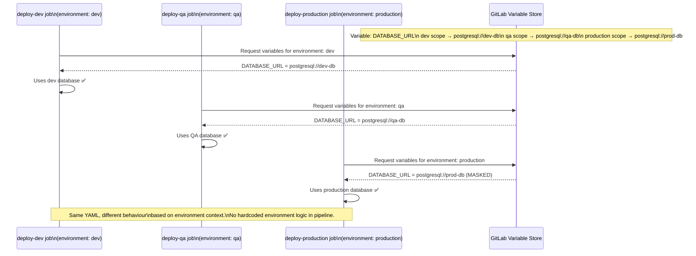
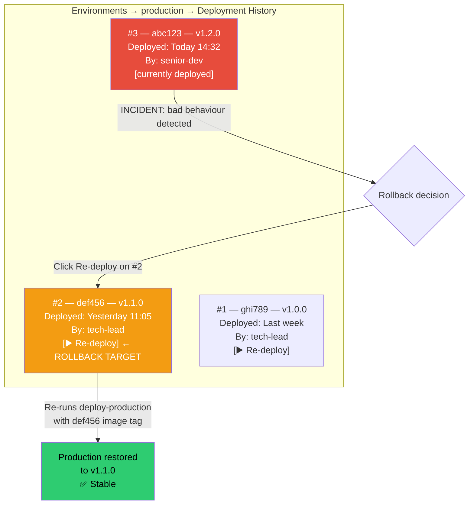
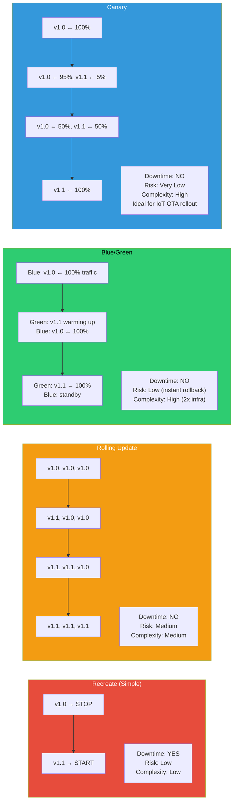

# ARCHITECTURE DIAGRAMS — MODULES 5 & 6
## CI/CD Fundamentals and Enterprise Delivery Pipelines
### Render at https://mermaid.live

---

## Diagram 1: GitLab CI/CD Pipeline Anatomy

---

## Diagram 2: Job Execution Flow (Runner Perspective)

---

## Diagram 3: Artifact Flow Between Stages

---

## Diagram 4: CI/CD Variables — Security Hierarchy

---

## Diagram 5: Enterprise Pipeline — Dev → QA → Production

---

## Diagram 6: Environment Scoped Variables — How They Inject

---

## Diagram 7: Deployment History and Rollback

---

## Diagram 8: Deployment Strategy Comparison

