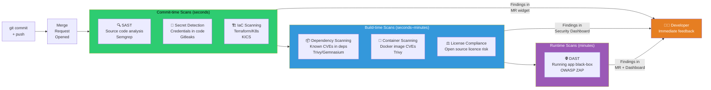
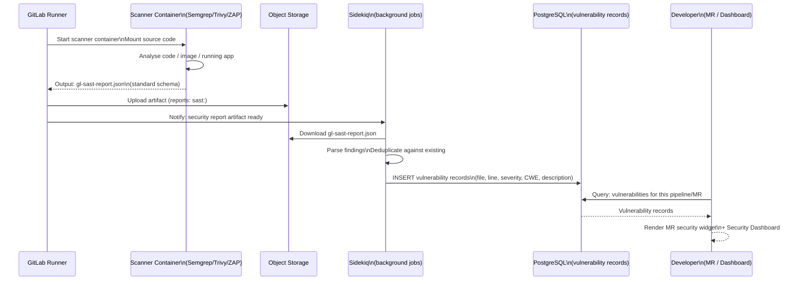
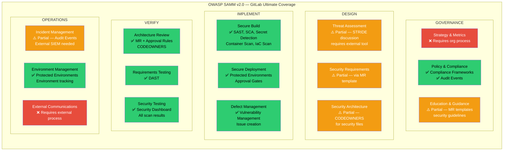
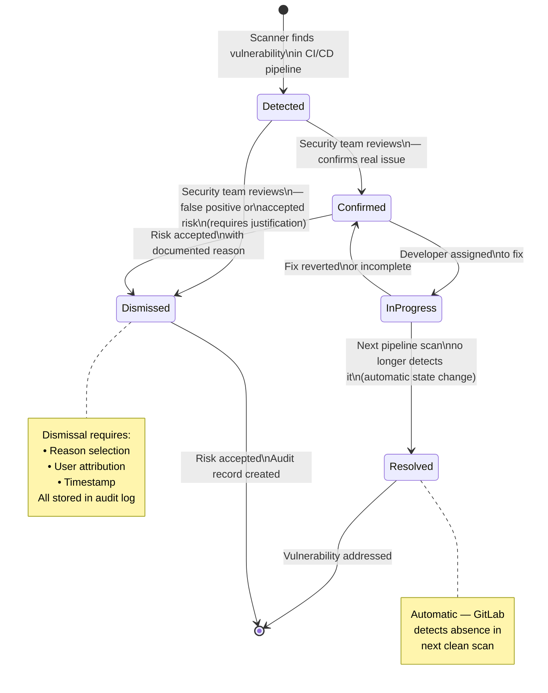
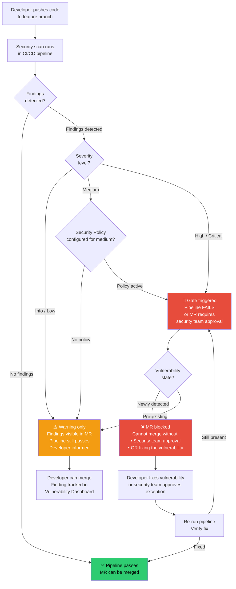
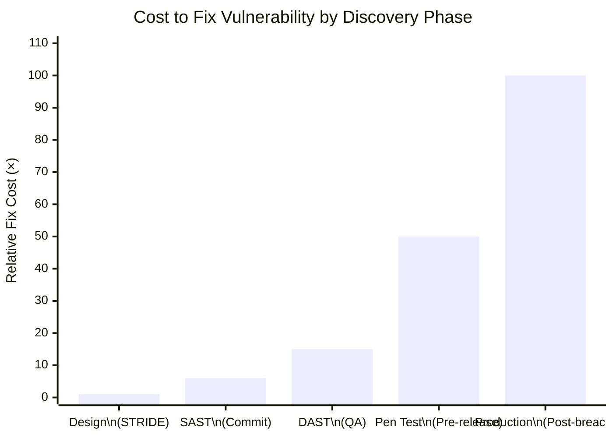
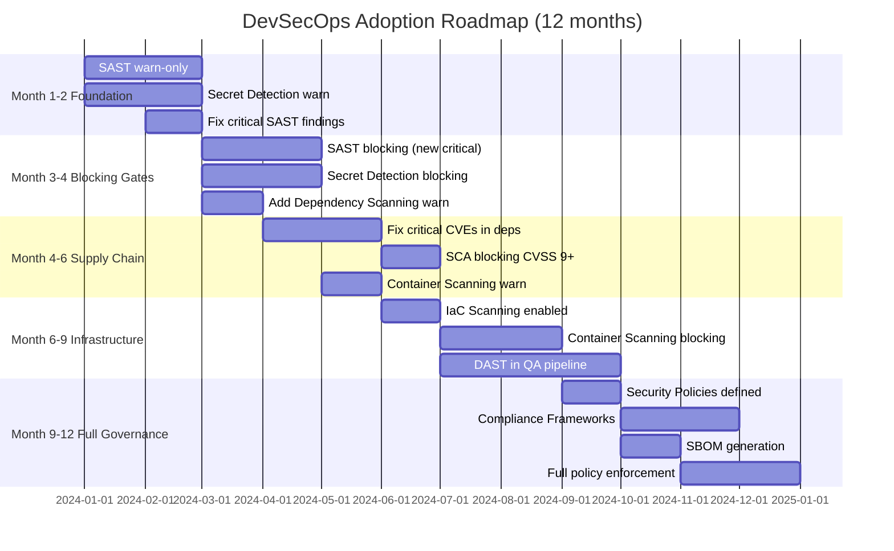
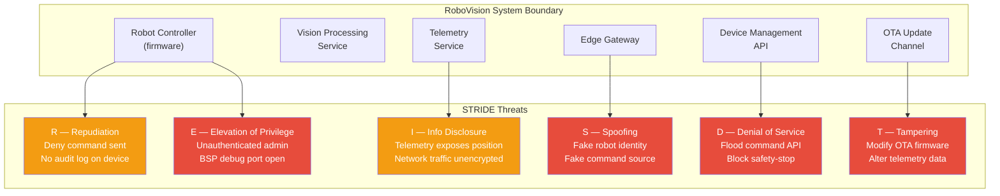

# ARCHITECTURE DIAGRAMS — MODULE 7
## Secure SDLC and DevSecOps
### Render at https://mermaid.live

---

## Diagram 1: Security Scan Placement in CI/CD Pipeline

---

## Diagram 2: GitLab Security Architecture — How Findings Reach the Dashboard

---

## Diagram 3: OWASP SAMM — GitLab Coverage Map

---

## Diagram 4: NIST SSDF Practice Groups and GitLab Mapping

```mermaid
graph LR
    subgraph PO ["PO — Prepare Organisation"]
        PO3["PO.3 Secure tooling\n→ Docker executor isolation\nRunner security"]
        PO5["PO.5 Secure environments\n→ Protected branches\nProject RBAC"]
    end

    subgraph PS ["PS — Protect Software"]
        PS1["PS.1 Protect source code\n→ Branch protection\nCODEOWNERS\nAudit trail"]
        PS2["PS.2 Protect components\n→ Signed artifacts\nPackage Registry\nContainer Registry"]
    end

    subgraph PW ["PW — Produce Well-Secured Software"]
        PW5["PW.5 Secure coding\n→ SAST\nSecret Detection\nin MR pipeline"]
        PW7["PW.7 Code review\n→ MR + Approval Rules\nFour-eyes principle"]
        PW8["PW.8 Test vulnerabilities\n→ DAST, SCA\nContainer Scanning"]
    end

    subgraph RV ["RV — Respond to Vulnerabilities"]
        RV1["RV.1 Identify vulnerabilities\n→ Security Dashboard\nVulnerability Report"]
        RV2["RV.2 Assess + remediate\n→ Vulnerability Management\nSeverity triage\nIssue creation"]
        RV3["RV.3 Root cause analysis\n→ Linked to commit\nMR history"]
    end

    PO --> PS --> PW --> RV

    style PO fill:#3498db,color:#fff
    style PS fill:#9b59b6,color:#fff
    style PW fill:#2ecc71,color:#000
    style RV fill:#e67e22,color:#fff
```

---

## Diagram 5: Vulnerability Lifecycle in GitLab

---

## Diagram 6: Security Gate — Warn vs. Block Decision Flow

---

## Diagram 7: Shift Left Cost Model

---

## Diagram 8: DevSecOps Maturity Adoption Roadmap

---

## Diagram 9: STRIDE Threat Model for RoboVision (Whiteboard Reference)

